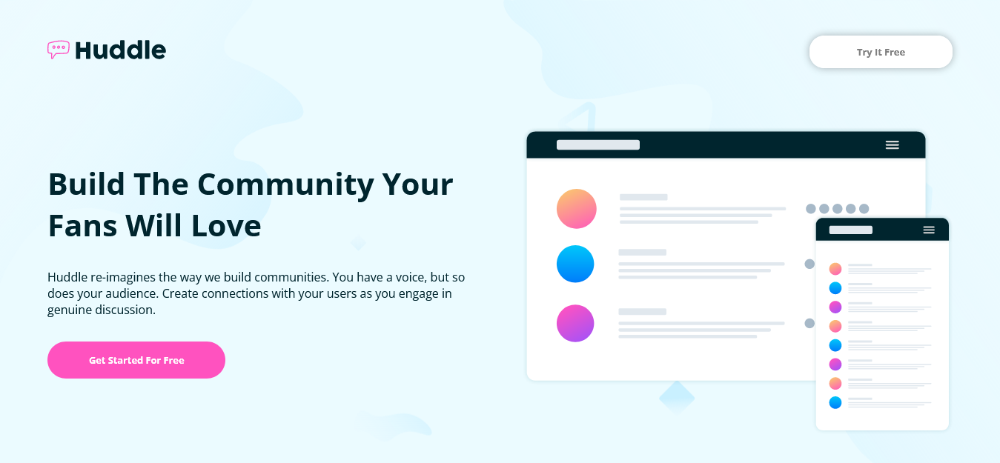

# Frontend Mentor - Huddle landing page with alternating feature blocks solution

This is a solution to the [Huddle landing page with alternating feature blocks challenge on Frontend Mentor](https://www.frontendmentor.io/challenges/huddle-landing-page-with-alternating-feature-blocks-5ca5f5981e82137ec91a5100). Frontend Mentor challenges help you improve your coding skills by building realistic projects. 

## Overview

### The challenge

Users should be able to:

- View the optimal layout for the site depending on their device's screen size
- See hover states for all interactive elements on the page

### Links

- Live Site URL: https://codepapa360.github.io/huddle-landing-page-with-alternating-feature-blocks-master-solution/
 

- Solution URL: https://www.frontendmentor.io/solutions/responsive-huddle-landing-page-with-alternating-feature-blocks-h9Nuq9IXuG

### Screenshot

#### Desktop preview

#### Mobile preview 

## My process

### Built with

- Semantic HTML5 markup
- CSS custom properties
- Flexbox
- CSS Grid
- Mobile-first workflow
- [Font Awesome](https://fontawesome.com/) - for social icons

## Author

- Frontend Mentor - [@CodePapa360](https://www.frontendmentor.io/profile/CodePapa360)
- Twitter - [@CodePapa360](https://www.twitter.com/CodePapa360)
- LinkedIn - [@CodePapa360](https://www.linkedin.com/in/codepapa360)
